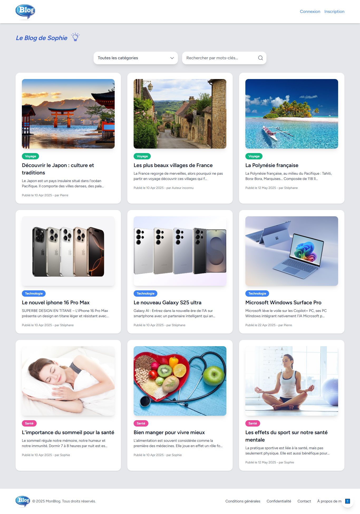

"# BlogLaravel"

# Le Blog de Sophie


## Description

Le Blog de Sophie est une plateforme développée avec **Laravel**, utilisant **Breeze** pour l’authentification, **Blade** pour le templating et **Tailwind CSS** pour le style. La base de données embarquée est **SQLite**, ce qui simplifie le démarrage et le déploiement.

---

## Aperçu




---

## Prérequis

* PHP >= 8.0
* Composer
* SQLite (inclus via PHP PDO)
* Node.js (>= 14.x) et npm ou yarn (pour compiler les assets Tailwind)
* Un compte GitHub (pour le déploiement sur GitHub Pages si souhaité)

---

## Installation

1. Clonez le dépôt :

   ```bash
   git clone https://github.com/votre-compte/le-blog-de-sophie.git
   cd le-blog-de-sophie
   ```
2. Installez les dépendances PHP et JS :

   ```bash
   composer install
   npm install   # ou yarn install
   ```
3. Configurez l’environnement :

   ```bash
   cp .env.example .env
   php artisan key:generate
   ```
4. Préparez la base de données SQLite :

   ```bash
   touch database/database.sqlite
   ```
5. Exécutez les migrations et les seeders :

   ```bash
   php artisan migrate --seed
   ```
6. Compilez les assets Tailwind :

   ```bash
   npm run dev   # ou yarn dev
   ```

---

## Développement & Déploiement

* **Lancer le serveur local** :

  ```bash
  php artisan serve
  ```

  Le site sera disponible sur `http://127.0.0.1:8000`.

* **Build de production** :

  ```bash
  npm run build   # ou yarn build
  ```

* **Déploiement sur GitHub Pages** (optionnel) :

  1. Générez une branche `gh-pages` :

     ```bash
     git checkout -b gh-pages
     ```
  2. Déployez les fichiers statiques (public) :

     ```bash
     git add public
     git commit -m "Deploy to GitHub Pages"
     git push origin gh-pages
     ```

---

## Contribution

Les contributions sont les bienvenues ! Merci de respecter les conventions suivantes :

* **Style de code** : utilisez ESLint, Prettier pour les assets JS/CSS et PHP CS Fixer pour le code PHP.
* **Branches** : nommez-les `feature/nom-de-la-fonctionnalité` ou `fix/description-du-bug`.
* **Commits** : suivez le format [Conventional Commits](https://www.conventionalcommits.org/).

Pour plus de détails, consultez le [Guide de contribution](CONTRIBUTING.md).

---

## Licence

Ce projet est sous licence MIT. Consultez le fichier [LICENSE](LICENSE) pour plus d’informations.

